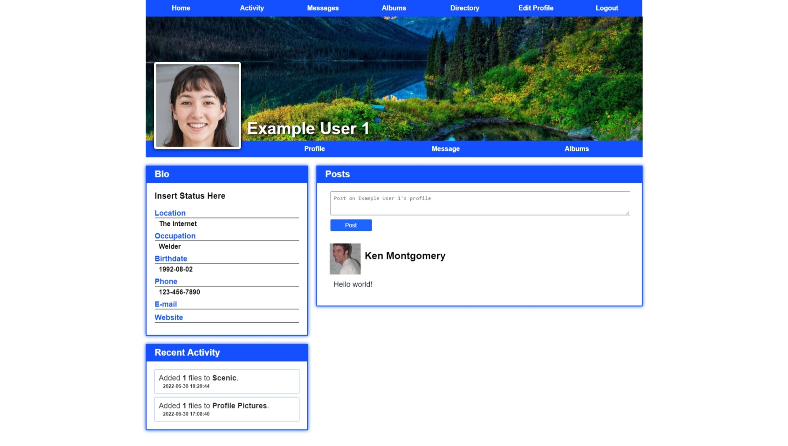

The informally named 'Social Network' is intended to be used as a private social network featuring:

<ul>
  <li>Restricted access to the site for visitors who aren't logged in.</li>
  <li>A profile page for each user that acts as a home page and can be customized with a profile and cover image.</li>
  <li>An activity page where recent profile posts, album uploads, and comments are listed.</li>
  <li>The ability for users to add albums containing arbitrary files, displaying a preview image for uploaded images and videos.</li>
  <li>The ability for users to privately message each other.</li>
  <li>A directory page that lists all users with accounts.</li>
  <li>A responsive layout supporting both desktop and mobile.</li>
  <li>The ability for administrators to add new users.</li>
</ul>

The application was developed part time so simplicity of the implementation was prioritized. Therefore, the front end uses basic HTML and CSS for displaying pages and relies
on users refreshing pages to receive updates.

